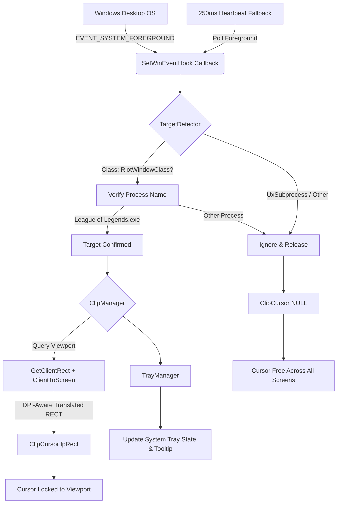

# mouseClip 🎯

[](https://microsoft.com/windows)
[](https://en.cppreference.com/w/cpp/17)
[](https://support-leagueoflegends.riotgames.com/hc/en-us/articles/360058083893)
[](LICENSE)
[-lightgrey.svg)](#architecture)

> **Lightweight, ultra-low latency, Vanguard-safe Windows background utility that locks the mouse cursor inside the League of Legends match window on multi-monitor setups.**

---

## 📌 The Problem

On multi-monitor setups—particularly those with **mismatched monitor resolutions, refresh rates, or mixed DPI scaling** (e.g., 1440p @ 100% next to 4K @ 150%)—League of Legends intermittently loses hardware cursor containment in Borderless and Windowed modes.

### Why It Breaks Gameplay
1. **Edge-Panning Failure**: Camera movement in League depends on slamming your cursor against the viewport boundary. When containment fails, the cursor bleeds across the monitor edge onto your secondary screen instead of panning the camera.
2. **Accidental Defocus**: Clicking an ability or moving the camera while the cursor has escaped triggers an unintended focus switch to a background app or desktop, freezing your game input and dropping frame pacing mid-teamfight.
3. **Inconsistent In-Game Lock**: League's native "Lock Cursor" option frequently breaks upon `Alt + Tab`, Discord overlays, or resolution mismatches.

---

## 💡 The Solution: `mouseClip`

`mouseClip` is an unobtrusive, zero-configuration C++ background daemon designed to continuously monitor your active desktop window and enforce hardware cursor boundary containment via the native Windows `ClipCursor` API.

- **Automatic Engagement**: Detects when the active match runtime window (`RiotWindowClass` / `League of Legends.exe`) is focused and instantly restricts the mouse cursor to the exact client viewport.
- **Instant Seamless Release**: When you `Alt + Tab`, focus Discord, or the game ends, boundary restrictions are immediately and cleanly released.
- **Zero Overhead**: Event-driven architecture with ~0.0% CPU usage and less than 2 MB of RAM footprint.

---

## 🛡️ 100% Vanguard & Anti-Cheat Safe

A major concern for players using companion tools is triggering anti-cheat systems like **Riot Vanguard**. `mouseClip` is designed from the ground up to be completely safe:

| Feature | Standard Cheats / Injections | `mouseClip` |
| :--- | :--- | :--- |
| **Process Memory** | Reads/writes game memory (`ReadProcessMemory`) | **Zero memory interaction** |
| **Code Injection** | Injects DLLs into the game process | **Zero code injection** |
| **API Hooking** | Hooks DirectX / DXGI / DirectInput | **Zero hooks inside game processes** |
| **Architecture** | In-process or kernel driver | **100% Out-of-Process Windows user-space** |
| **OS Interaction** | Intercepts game packets or render calls | **Standard Win32 Desktop Window APIs** |

> [!NOTE]
> `mouseClip` interacts exclusively with Windows (`user32.dll`), calling standard OS desktop APIs (`SetWinEventHook`, `GetClientRect`, `ClientToScreen`, and `ClipCursor`). It never reads, modifies, opens handles to, or inspects League's memory or render pipeline. To the OS and Vanguard, it is indistinguishable from standard Windows desktop management tools.

---

## ✨ Features

- 🎯 **Target-Specific Matching**: Specifically targets the active match runtime (`RiotWindowClass` / `League of Legends.exe`) while ignoring the Chromium-embedded launcher (`UxSubprocess.exe`, `LeagueClient.exe`).
- 🖥️ **PerMonitorV2 DPI Aware**: Embedded with Windows `PerMonitorV2` awareness to eliminate DPI virtualization distortion across mixed-scale monitors (100%, 125%, 150%, 200%).
- ⚡ **Microsecond Event Delivery**: Registers an OS-level `SetWinEventHook(EVENT_SYSTEM_FOREGROUND)` callback with a 250ms fallback heartbeat to catch all edge cases without polling loops.
- 🎛️ **Interactive System Tray**: Sits silently in your system notification tray with live status icons:
  - 🟢 **Locked**: Actively confining cursor to match window.
  - ⚪ **Idle**: Standing by (game minimized or other app focused).
  - 🟡 **Paused**: Manually bypassed via hotkey.
- ⌨️ **Global Hotkeys**:
  - `Ctrl + Alt + C`: Toggle manual pause / resume boundary locking on the fly.
  - `Ctrl + Alt + End` or `Ctrl + Alt + Q`: Immediate emergency kill-switch (restores cursor bounds and terminates cleanly).
- 🪶 **Zero Third-Party Dependencies**: Pure native C++17 statically linked against standard Windows libraries (`user32`, `kernel32`, `shell32`, `gdi32`). No runtime DLLs, no .NET dependencies, no installation needed.

---

## 🕹️ Architecture & How It Works



### Screen-Space Coordinate Translation
Many rudimentary clipping tools erroneously pass `GetWindowRect` to `ClipCursor`, leading to offset clipping that includes title bars, invisible borders, and drop shadows in Windowed mode.

`mouseClip` queries `GetClientRect` and translates the client boundary origin using `ClientToScreen`:
```cpp
POINT origin = { 0, 0 };
ClientToScreen(hwnd, &origin);

RECT screenClip;
screenClip.left   = origin.x;
screenClip.top    = origin.y;
screenClip.right  = origin.x + (clientRect.right - clientRect.left);
screenClip.bottom = origin.y + (clientRect.bottom - clientRect.top);

ClipCursor(&screenClip);
```
This guarantees an exact sub-pixel boundary lock matching the playable game frame.

---

## 🚀 Quick Start

### 1. Download
Download the latest prebuilt standalone binaries from the **[Releases](https://github.com/seolyam/mouseClip/releases)** page:
- **`mouseClip.exe`** — Production windowed release (completely silent, runs in tray, no console).
- **`mouseClip_debug.exe`** — Diagnostic release (opens console window showing real-time WinEvent logs).

### 2. Run
Simply double-click `mouseClip.exe`. It will appear in your system notification tray.
Whenever League of Legends is in the foreground, your cursor will stay locked inside the screen.

### 3. Hotkeys

| Hotkey | Action | Description |
| :--- | :--- | :--- |
| <kbd>Ctrl</kbd> + <kbd>Alt</kbd> + <kbd>C</kbd> | **Toggle Pause / Resume** | Manually pause or resume cursor boundary locking at any time. |
| <kbd>Ctrl</kbd> + <kbd>Alt</kbd> + <kbd>End</kbd> | **Emergency Kill-Switch** | Instantly releases cursor bounds and exits application cleanly. |
| <kbd>Ctrl</kbd> + <kbd>Alt</kbd> + <kbd>Q</kbd> | **Alternate Kill-Switch** | Secondary quick-exit hotkey. |

---

## 🔍 Diagnostic Mode (`mouseClip_debug.exe`)

For troubleshooting or verifying coordinate calculations on your multi-monitor layout, launch `mouseClip_debug.exe`:

```text
======================================================================
     mouseClip - Diagnostic Mode (Verbose Logging Enabled)
======================================================================
[01:30:15.120] [INIT] mouseClip v1.0 starting up...
[01:30:15.122] [INIT] DPI Awareness context initialized (PerMonitorV2).
[01:30:15.124] [CONFIG] Target criteria: Window Class 'RiotWindowClass' / Process 'League of Legends.exe'
[01:30:15.125] [CONFIG] Excluded: LeagueClient launcher & UxSubprocess
[01:30:15.126] [HOTKEY] Hotkeys registered: Ctrl+Alt+C (Toggle) | Ctrl+Alt+End / Ctrl+Alt+Q (Kill-Switch)
[01:30:15.128] [TRAY] System tray icon successfully initialized.
[01:30:15.130] [HOOK] WinEventHook (EVENT_SYSTEM_FOREGROUND) installed successfully.
[01:30:15.131] [TIMER] Heartbeat timer started (200ms interval).
[01:30:15.132] [READY] mouseClip is active and monitoring.
[01:30:18.440] [LOCK] BOUND: Locked cursor to [2560x1440] at screen (0,0 - 2560,1440) | Process: League of Legends.exe (PID 14920)
[01:30:25.812] [RELEASE] Target window defocused/closed. Cursor bounds released.
```

---

## 🛠️ Building from Source

### Prerequisites
- Windows 10 or 11 (64-bit)
- Microsoft Visual Studio 2022 (Community, Professional, or Build Tools) with the **Desktop development with C++** workload (MSVC v143+).
- *(Optional)* CMake 3.20+

### Option A: Using `build.bat` (Recommended)
`build.bat` automatically discovers your Visual Studio installation via `vswhere.exe`, initializes the MSVC x64 build environment, compiles the manifest/resources, and links both binaries:

```cmd
git clone https://github.com/seolyam/mouseClip.git
cd mouseClip
build.bat
```

Binaries will be output to `bin\`:
- `bin\mouseClip.exe`
- `bin\mouseClip_debug.exe`

### Option B: Using CMake
```cmd
git clone https://github.com/seolyam/mouseClip.git
cd mouseClip
cmake -B build -G "Visual Studio 17 2022" -A x64
cmake --build build --config Release
```

---

## 🧪 Automated Testing & Verification

The repository includes an extensive unit and functional test suite:

### 1. Native Unit Tests (`tests/unit_tests.cpp`)
Compiles a standalone test harness verifying coordinate calculations, boundary edge conditions, process exclusion rules, and mock window lifecycle:

```cmd
cl.exe /nologo /std:c++17 /O2 /MT /W4 /EHsc tests\unit_tests.cpp src\clip_manager.cpp src\target_detector.cpp /Fe:bin\unit_tests.exe /link user32.lib kernel32.lib
bin\unit_tests.exe
```

Output:
```text
==================================================
        mouseClip Native Unit Test Suite          
==================================================
[TEST 1] Testing Target Detector Window Class Validation... [PASS]
[TEST 2] Testing Launcher Process Exclusion...               [PASS]
[TEST 3] Testing Coordinate Translation Math...             [PASS]
[TEST 4] Testing ClipManager State Transitions...           [PASS]
[TEST 5] Testing Boundary Edge Invariants...                [PASS]
--------------------------------------------------
RESULTS: 27 assertions checked. 0 failures.
*** ALL TESTS PASSED SUCCESSFULLY! ***
```

### 2. End-to-End System Test (`test_verification.ps1`)
Runs an automated integration test against a simulated `RiotWindowClass` window (`tests/mock_game.cpp`), querying OS cursor coordinates via native Win32 P/Invoke before, during, and after game runtime.

```powershell
powershell -ExecutionPolicy Bypass -File .\test_verification.ps1
```

---

## 🔄 Run on Windows Startup (Optional)

To have `mouseClip` run quietly in the background whenever your computer boots:

1. Press <kbd>Win</kbd> + <kbd>R</kbd>, type `shell:startup`, and press <kbd>Enter</kbd>.
2. Right-click inside your Startup folder -> **New** -> **Shortcut**.
3. Browse to `mouseClip.exe` (or `run.bat`) and click **Finish**.

---

## ❓ FAQ

#### Will this ban my League of Legends account?
**No.** `mouseClip` uses only legitimate Windows desktop APIs (`ClipCursor`, `GetClientRect`). It operates 100% out-of-process, never hooks game code, never writes to game memory, and never injects DLLs.

#### What happens if I `Alt + Tab` out of the game?
Windows fires an `EVENT_SYSTEM_FOREGROUND` event to `mouseClip`, which immediately calls `ClipCursor(NULL)`. Your cursor is instantly freed to move across all screens until you refocus the game.

#### Does this work with Fullscreen, Windowed, and Borderless?
Yes. It is particularly beneficial in **Borderless** mode, where multi-monitor cursor escape most commonly occurs.

#### How do I exit `mouseClip`?
Right-click the icon in your system tray and select **Exit**, or press the global hotkey <kbd>Ctrl</kbd> + <kbd>Shift</kbd> + <kbd>F12</kbd>.

---

## 📄 License

This project is licensed under the [MIT License](LICENSE).
Feel free to use, modify, and distribute it freely.
